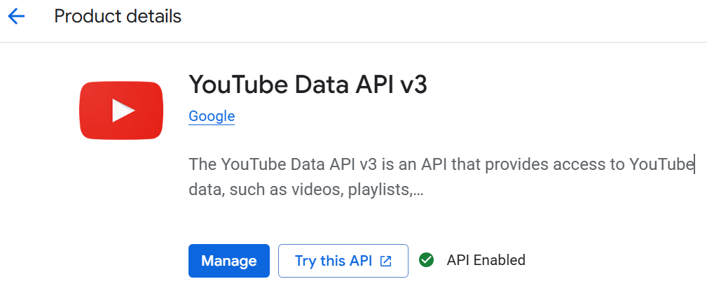
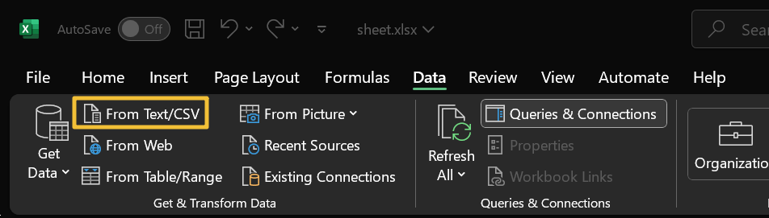
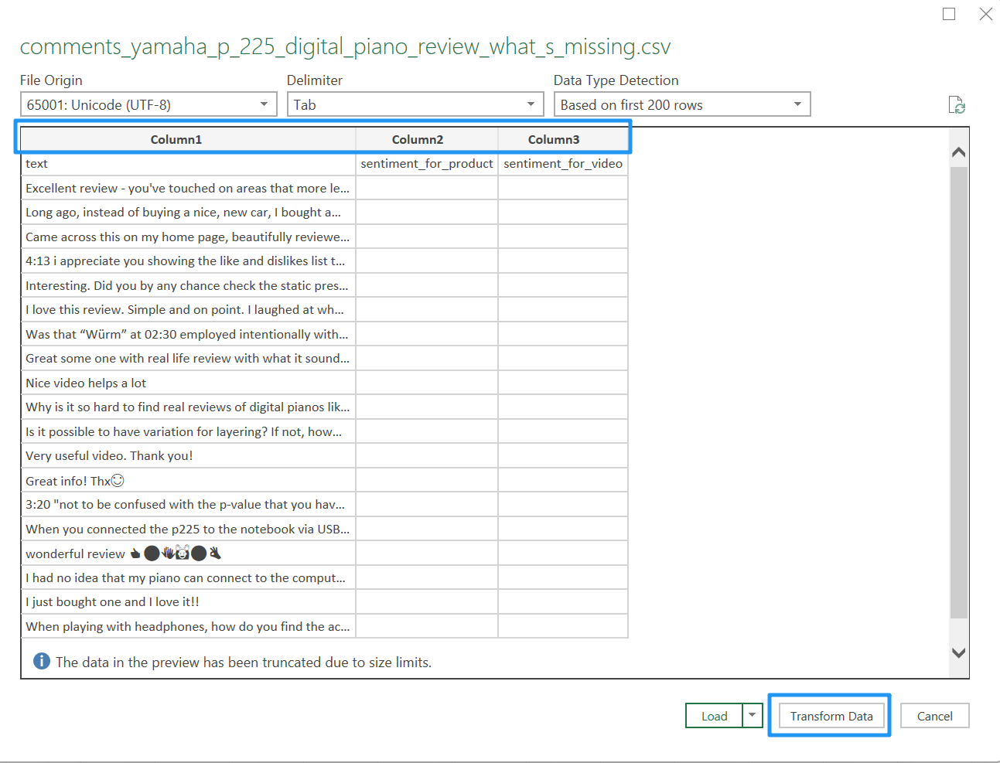
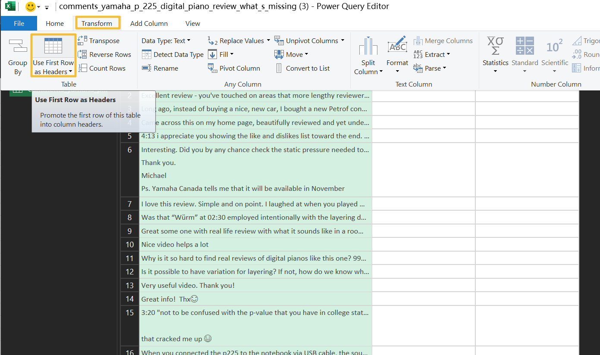
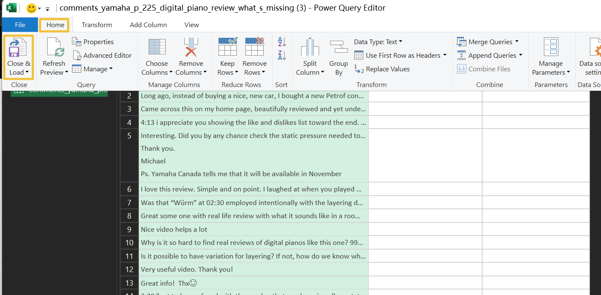
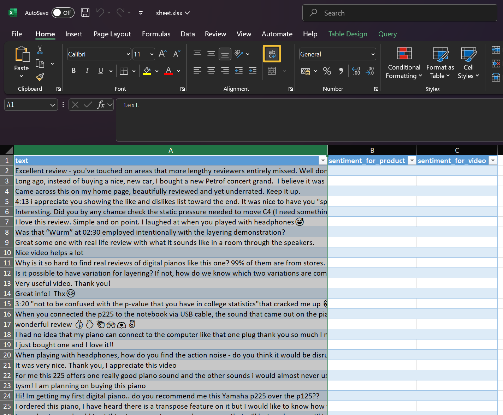
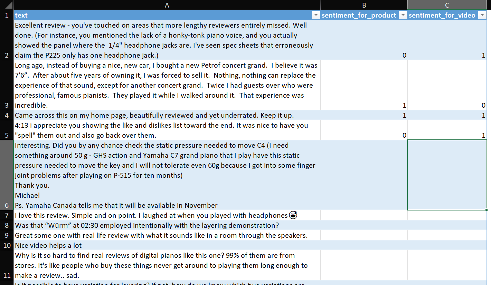

# How to Label Data

## How to Obtain Comments for a Video?

For time saving, you can directly message Jin to ask for comments files. 

You can also use my script to download comments following these steps below. 

### Obtain your YouTube API Key

Since we are not using the web crawler, but official API to obtain comments. It's better to use your own API key. But you can also ask for my key and I will send you.


Go to: https://console.cloud.google.com/marketplace/product/google/youtube.googleapis.com



And you can follow the instructions on the website to obtain your API key.

### Replace your key in `get_youtube_comments.py`

Simply download this file [get_youtube_comments.py](../src/get_youtube_comments.py) or you can deploy the whole repository if you want.

Replace your API key in line 9 with your own key: 

```python
# Replace with your own key or Jin's Key
# For some reasons I cannot directly put it here.
API_KEY = ""
```

### Run the Script

Install this library: 

```
pip install google-api-python-client
```

Run the code by this command: 
```
python get_youtube_comments.py <video_url> <sample_number>
```

Here's an example command: 
```
python get_youtube_comments.py https://youtu.be/1k4EQaBiOZc?si=wVOOcKxk_dZJhAiu
```

If you want to specify the sample number (like selcting only 20 comments), you can add it after the video URL. For example:
```     
python get_youtube_comments.py https://youtu.be/1k4EQaBiOZc?si=wVOOcKxk_dZJhAiu 20
```

If you don't specify the sample number, it will download up to 100 comments under this video.

You can also direcly run the file if you don't like command line. Just remember to change your main function as: 

```python
if __name__ == "__main__":
    # Example for calling the function
    save_youtube_comments("https://youtu.be/1k4EQaBiOZc?si=wVOOcKxk_dZJhAiu", sample_num=100)
```

The result CSV file will be saved at `/data/comments_unlabelled/`. 


## Import CSV Files to Excel

Click Data > From Text/CSV
Choose the CSV file



Click "Transform Data" if the header is `[column1, column2, column3]`



Click Transform > "Use the first row as headers"



Click Home > "Close and Load"



Select the first column, click "Wrap Text"



Now you can label each comment!



After labelling all comments, save the file as a **TXT** file.

**Important:**  DO NOT save as CSV file, because we want `\t` to be the delimiter, not commas. 

Upload this file to `Comments Labeled (in txt)` shared folder on Google Drive. 

## Labeling Rules

1. **Sentiment for product**: Comments sentiment for the products
Values: Positive (1) / Neutral (0) / Negative (-1)

2. **Sentiment for Video**: Comments indicating if the video is useful
Values: Positive (1) / Neutral (0) / Negative (-1)

If the comment is not relevant to product/video feedback (like questions), assign both metrics to 'neutral'

If the comment is unreadable or alian text, like `😮🎉😅`, `222`, `To`, just delete it from the dataset!


